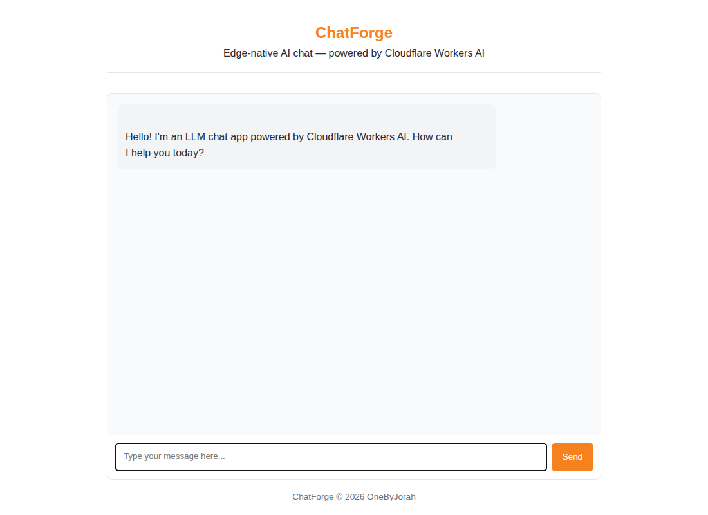

<div align="center">

  

  # 🔥 ChatForge

  **AI-Powered Chat Interface & Conversation Management Platform**

  Build, deploy, and manage intelligent chatbots with multi-model support and enterprise features

  [](https://opensource.org/licenses/MIT)
  [](https://www.python.org/)
  [](https://fastapi.tiangolo.com/)
  [](https://www.docker.com/)
  [](https://developer.mozilla.org/en-US/docs/Web/API/WebSockets_API)

  [Features](#-features) • [Quick Start](#-quick-start) • [Architecture](#-architecture) • [API](#-api-reference) • [Contributing](#-contributing)

</div>

---

## 📸 Screenshots

<div align="center">

| Chat Interface | Model Selection | Conversation History |
|----------------|-----------------|---------------------|
|  |  |  |

</div>

> 💡 **Tip:** ChatForge supports real-time streaming responses with WebSocket connections

---

## ✨ Features

| Feature | Description |
|---------|-------------|
| 🤖 **Multi-Model Support** | OpenAI, Anthropic, Ollama, and custom LLM endpoints |
| 💬 **Real-Time Chat** | WebSocket-powered instant responses |
| 📚 **Conversation Management** | Save, search, and organize chat history |
| 🔐 **Authentication** | JWT-based user authentication |
| 🎨 **Custom Themes** | Dark/Light mode with customizable UI |
| 📊 **Usage Analytics** | Track token usage and costs per conversation |
| 🔌 **Plugin System** | Extend functionality with custom plugins |
| 🐳 **Docker Ready** | One-command deployment |

---

## 🚀 Quick Start

### Prerequisites

- Docker & Docker Compose
- Git
- API keys for desired LLM providers (optional for local models)

### Installation

```bash
# Clone the repository
git clone https://github.com/OneByJorah/ChatForge.git
cd ChatForge

# Start with Docker
docker compose up -d
```

### Access the Platform

Open **http://localhost:3000** in your browser

### Environment Variables

| Variable | Default | Description |
|----------|---------|-------------|
| `CHATFORGE_PORT` | `3000` | Application port |
| `DATABASE_URL` | `sqlite:///./chatforge.db` | Database connection |
| `JWT_SECRET` | `your-secret-key` | Authentication secret |
| `OPENAI_API_KEY` | - | OpenAI API key (optional) |
| `ANTHROPIC_API_KEY` | - | Anthropic API key (optional) |

---

## 🏗️ Architecture

```
┌─────────────────────────────────────────────────────────────┐
│                       ChatForge                             │
├─────────────────────────────────────────────────────────────┤
│                                                             │
│   ┌─────────┐      ┌─────────┐      ┌─────────────────┐   │
│   │ Browser │ ───▶ │  Nginx  │ ───▶ │  FastAPI Server  │   │
│   │   SPA   │ ◀─── │   SSL   │ ◀─── │    WebSocket     │   │
│   └─────────┘      └─────────┘      └────────┬────────┘   │
│                                               │             │
│                                   ┌───────────┴───────────┐ │
│                                   │                       │ │
│                        ┌──────────┴──────────┐           │ │
│                        │                     │           │ │
│                        ▼                     ▼           │ │
│                 ┌──────────┐          ┌──────────┐      │ │
│                 │  SQLite  │          │   LLM    │      │ │
│                 │  Users   │          │ Providers│      │ │
│                 │  History │          │ Gateway  │      │ │
│                 └──────────┘          └──────────┘      │ │
│                                                           │ │
└─────────────────────────────────────────────────────────────┘
```

### Tech Stack

| Component | Technology |
|-----------|------------|
| **Backend** | Python 3.10+, FastAPI, WebSocket |
| **Frontend** | React 18, TypeScript, Tailwind CSS |
| **Database** | SQLite / PostgreSQL |
| **Auth** | JWT + bcrypt |
| **LLM Gateway** | LiteLLM / Custom adapters |

---

## 📁 Project Structure

```
ChatForge/
├── backend/                  # FastAPI backend
│   ├── main.py              # Application entry
│   ├── routers/             # API routes
│   │   ├── auth.py          # Authentication endpoints
│   │   ├── chat.py          # Chat endpoints
│   │   └── models.py        # Model management
│   ├── models/              # SQLAlchemy models
│   ├── services/            # Business logic
│   │   ├── llm.py           # LLM provider integration
│   │   └── conversation.py  # Conversation management
│   └── websocket/           # WebSocket handlers
├── frontend/                # React SPA
│   ├── src/
│   │   ├── components/      # UI components
│   │   ├── pages/           # Page components
│   │   └── hooks/           # Custom hooks
│   └── public/              # Static assets
├── plugins/                 # Plugin system
├── docs/                    # Documentation
│   └── screenshots/         # UI screenshots
├── docker-compose.yml       # Docker deployment
└── nginx.conf               # Reverse proxy
```

---

## 🔌 API Reference

### Authentication

| Endpoint | Method | Description |
|----------|--------|-------------|
| `/api/auth/register` | `POST` | Register new user |
| `/api/auth/login` | `POST` | Login user |
| `/api/auth/refresh` | `POST` | Refresh JWT token |

### Chat

| Endpoint | Method | Description |
|----------|--------|-------------|
| `/api/chat` | `POST` | Send message (HTTP) |
| `/ws/chat/{conversation_id}` | `WS` | Real-time chat (WebSocket) |
| `/api/conversations` | `GET` | List conversations |
| `/api/conversations/{id}` | `GET` | Get conversation |
| `/api/conversations/{id}/history` | `GET` | Get chat history |

### Models

| Endpoint | Method | Description |
|----------|--------|-------------|
| `/api/models` | `GET` | List available models |
| `/api/models/{id}/status` | `GET` | Check model status |

### Example Usage

```bash
# Register user
curl -X POST http://localhost:3000/api/auth/register \
  -H "Content-Type: application/json" \
  -d '{"email": "user@example.com", "password": "securepass"}'

# Login and get token
curl -X POST http://localhost:3000/api/auth/login \
  -H "Content-Type: application/json" \
  -d '{"email": "user@example.com", "password": "securepass"}'

# Send chat message
curl -X POST http://localhost:3000/api/chat \
  -H "Authorization: Bearer <token>" \
  -H "Content-Type: application/json" \
  -d '{"model": "gpt-4", "message": "Hello, world!"}'
```

---

## 🛠️ Development

### Local Development

```bash
# Clone the repository
git clone https://github.com/OneByJorah/ChatForge.git
cd ChatForge

# Backend setup
cd backend
python -m venv venv
source venv/bin/activate
pip install -r requirements.txt

# Frontend setup
cd ../frontend
npm install
npm run dev
```

### Running Tests

```bash
# Backend tests
cd backend
pytest

# Frontend tests
cd frontend
npm test
```

---

## 🔌 Plugin Development

ChatForge supports a plugin system for extending functionality:

```python
# plugins/my_plugin/plugin.py
from chatforge.plugins import BasePlugin

class MyPlugin(BasePlugin):
    name = "my_plugin"
    version = "1.0.0"
    
    def on_message(self, message: str) -> str:
        # Custom message processing
        return message.upper()
```

---

## 🤝 Contributing

Contributions are welcome! Please see [CONTRIBUTING.md](CONTRIBUTING.md) for guidelines.

1. Fork the repository
2. Create your feature branch (`git checkout -b feature/amazing-feature`)
3. Commit your changes (`git commit -m 'Add amazing feature'`)
4. Push to the branch (`git push origin feature/amazing-feature`)
5. Open a Pull Request

---

## 📄 License

This project is licensed under the MIT License - see the [LICENSE](LICENSE) file for details.

---

## 🔒 Security

For security concerns, please see [SECURITY.md](SECURITY.md).

---

## 💬 Support

- 📧 Email: support@jorah.one
- 🐛 Issues: [GitHub Issues](https://github.com/OneByJorah/ChatForge/issues)
- 📖 Docs: [Documentation](docs/)

---

<div align="center">

  **Built with ❤️ by [Jhonattan L. Jimenez](https://github.com/OneByJorah)**

  [⬆ Back to Top](#-chatforge)

</div>
